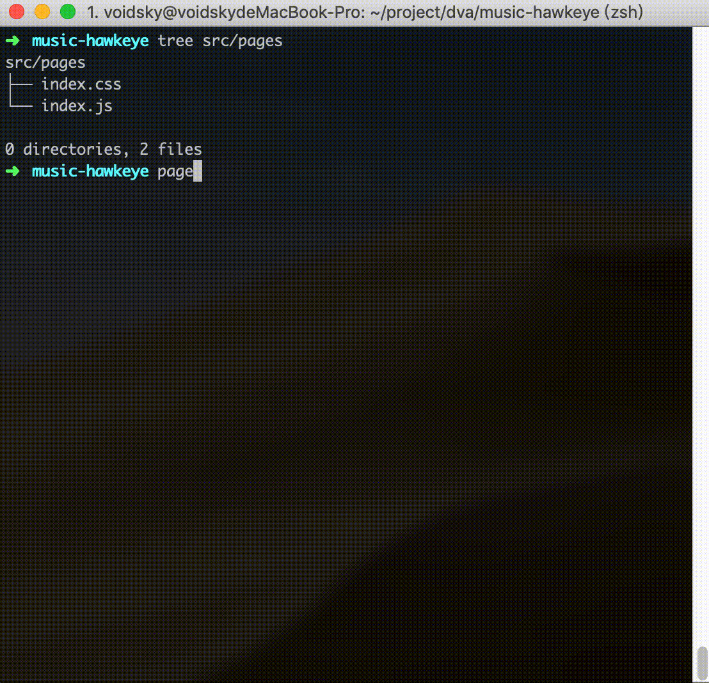
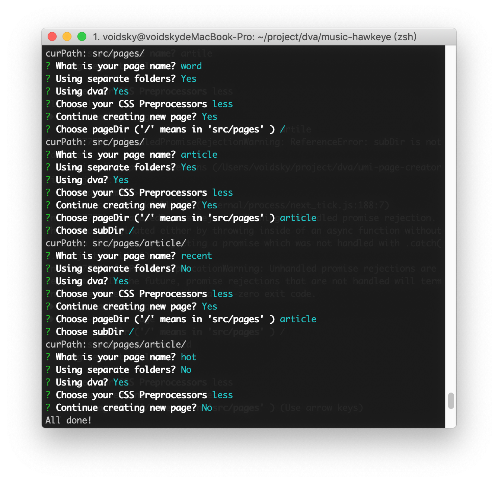
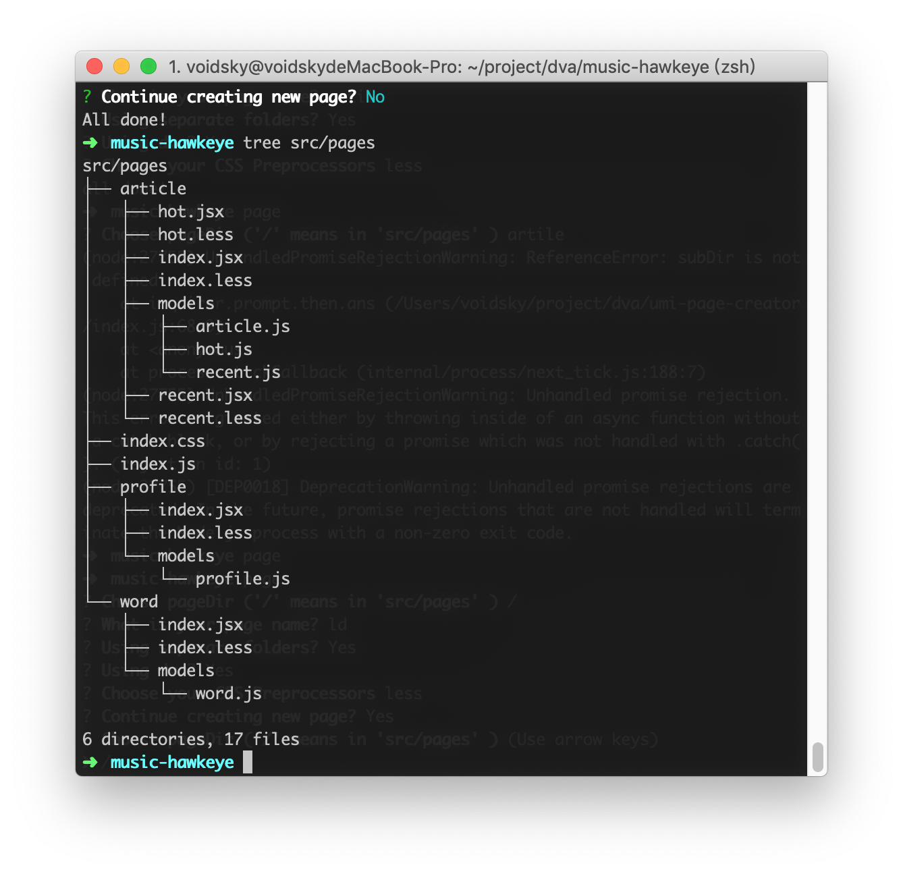
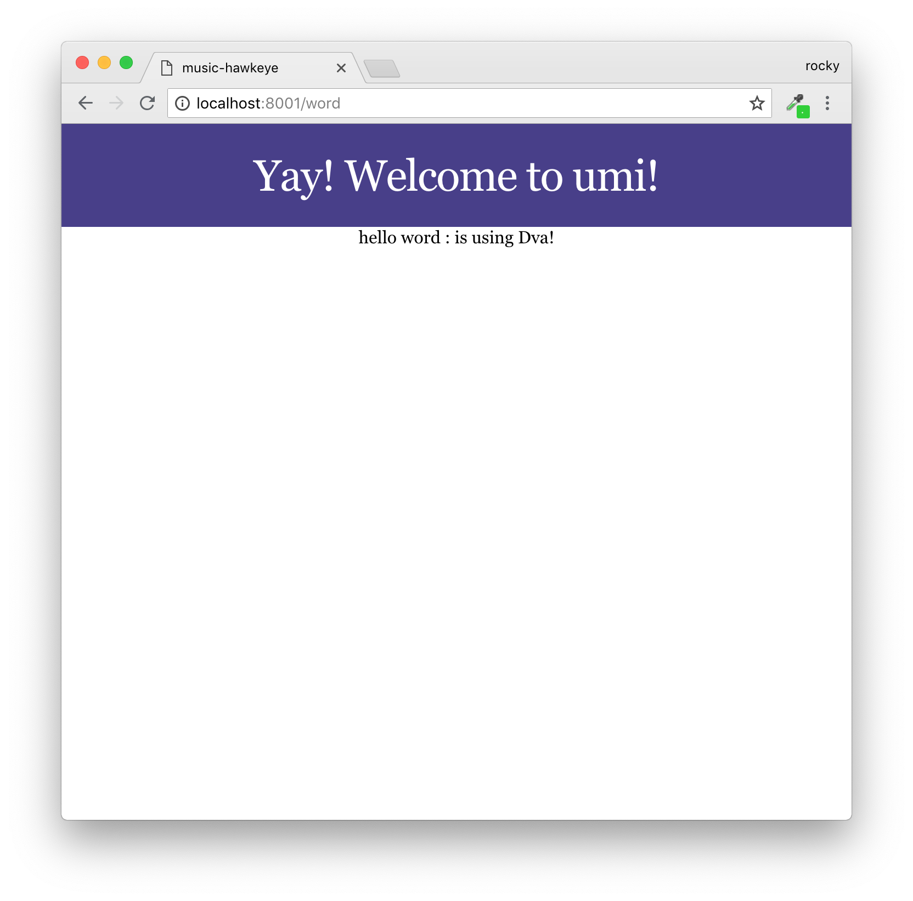

# umi-page-creator
A command line tool to help you generate umi pages more efficiently.

一个高效创建umi页面的CLI小工具

# Installation 安装方法

```
npm i umi-page-creator -g
```

# Usage 使用方法

在任意umi项目中输入`page`命令就行了




# Options 选项

目前提供的选项有：

- 是否使用独立目录：
  - 开启：会为该页面单独创建一个文件夹
  - 不开启：会使用当前目录创建页面，并共用models目录
- 是否开启dva:
  - 开启：会为当前页面自动建立connect连接，并且创建model文件，model中会写好`effects`, `reducers`, `subscriptions`
  - 不开启：就是创建一个普通页面，不会使用connect

- css预处理：
  - less：会自动创建一个页面使用的less文件
  - scss：会自动创建一个页面使用的scss文件
  - css: 会自动创建一个页面使用的css文件


# Practice  实践

例如，我想创建一个如下路由结构：
- words 单词页
- article 文章页
    - recent 最近文章
    - hot  热门文章
- profile 我的信息

可以通过使用`umi-page-creator` 快速创建：

生成的目录结构如下：



运行`npm start`可以看到实际结果：


